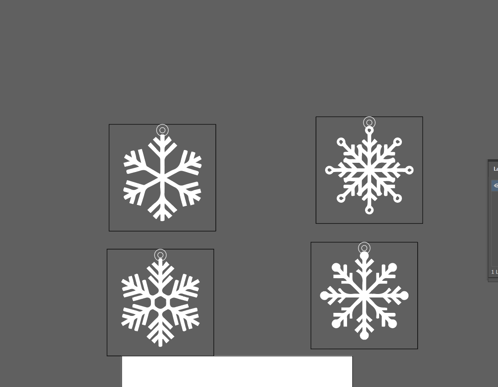
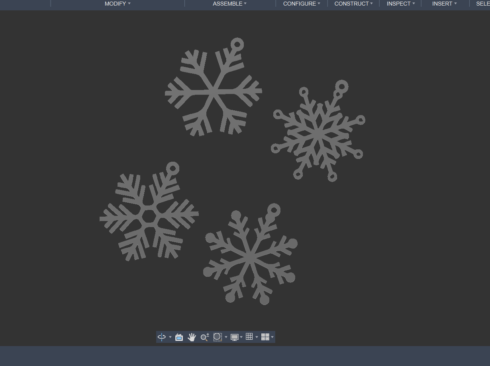
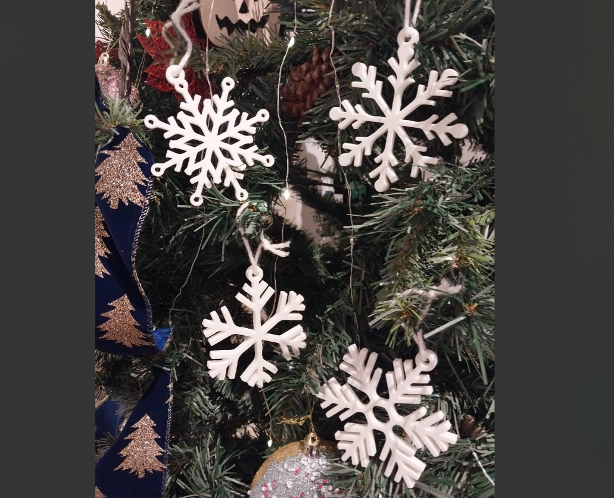
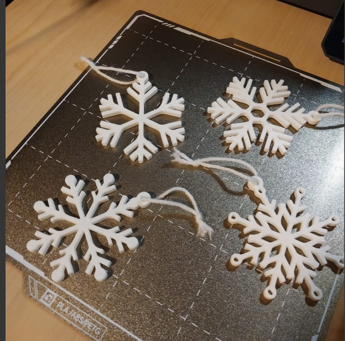
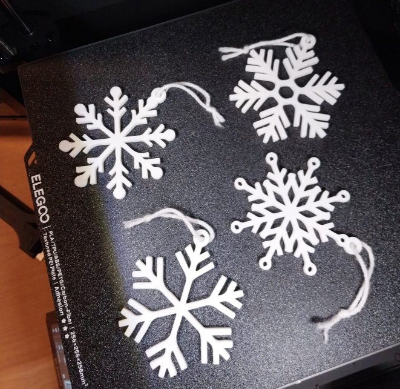

Snow flakes ornaments

a simple proyect, an easy print and without supports!!

Design proces:

Illustration; this being the first step, with some insipration from outside, a pen, paper and music, the initla sketches were doone, sou after the sketch I hopped into illustrator vectorizing this images and later exporting them as an dxf 

3d Modeling: With the dxf done, it was just light work to hop into fusion 360 and extrude the little pieces, taking me just 30 minutes.

3d print: This took a bit more time since i dont the setting dialed in for my 3d printer, so i had a bit of warping, but nowwww HOLY the print was perfect, the little brim I added make it perfect, no issues, so fast and most importanly supportless

If anyone wants to donwload the model here is the link in either makerwold (printed in my friend bambulab a1 mini) orrr nexprint (printed myself in my centauri carbon)

https://makerworld.com/es/models/2094323-holiday-snowflake-ornament-pack#profileId-2264283

https://www.nexprint.com/en/models/G0458268?component=UserPublish&printConfigId=G3687065
